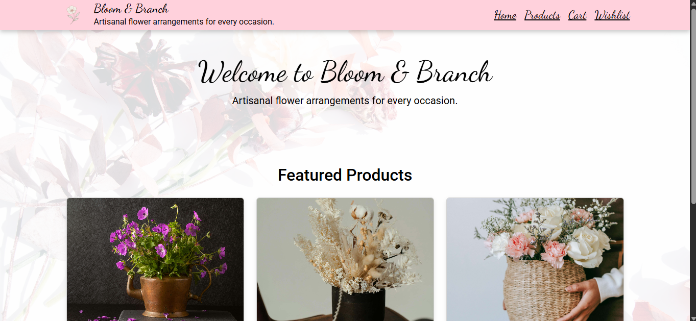
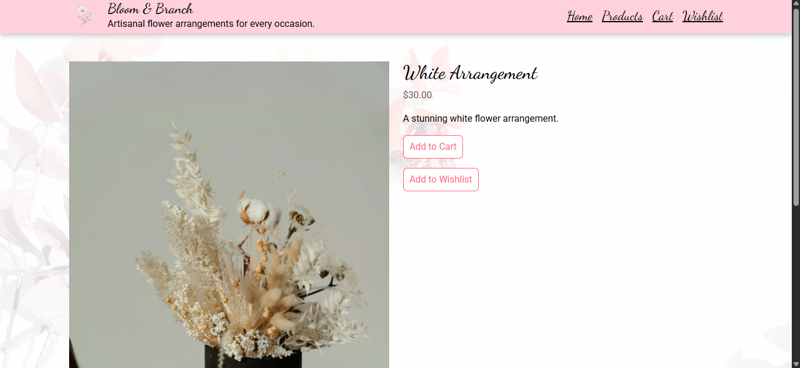
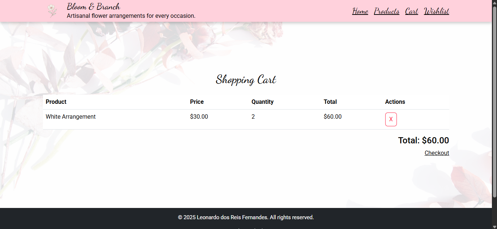

# Bloom and Branch

**Bloom and Branch** is a mock e-commerce website designed to showcase a modern and responsive online shopping experience. Key features include:

- Product listing and detailed product pages.
- Shopping cart functionality with real-time updates.
- Wishlist management for saving favorite items.
- Interactive toast notifications for user feedback.
- Responsive design for seamless use across devices.

This project demonstrates proficiency in React, Context API, and modern web development practices.

---

## Features

- **Product Catalog**: Browse a variety of products with detailed descriptions and images.
- **Shopping Cart**: Add, remove, and manage items in the cart.
- **Wishlist**: Save favorite products for future reference.
- **Responsive Design**: Optimized for both desktop and mobile devices.
- **Interactive Feedback**: Toast notifications for actions like adding items to the cart or wishlist.

---

## Live Demo

Experience the project live: [Bloom and Branch](https://bloom-and-branch.vercel.app/)

---

## Screenshots

### Homepage


### Product Details


### Shopping Cart


---

## Getting Started

Follow these steps to set up and run the project locally.

### Prerequisites

Ensure the following are installed on your system:

- [Node.js](https://nodejs.org/) (LTS version recommended)
- [npm](https://www.npmjs.com/) (comes with Node.js)

### Installation

1. Clone the repository:
    ```bash
    git clone https://github.com/your-username/bloom-and-branch.git
    cd bloom-and-branch
    ```

2. Install dependencies:
    ```bash
    npm install
    ```

### Running the Application

Start the development server:
```bash
npm start
```

This will open the app in your default browser at `http://localhost:3000`. The app will automatically reload if you make changes to the source code.

---

### Running Tests

Run tests in watch mode:
```bash
npm test
```

For more details, refer to the testing documentation.

---

### Building for Production

Create a production-ready build:
```bash
npm run build
```

The optimized build will be available in the `build` folder. For deployment instructions, see the deployment documentation.

---

### Ejecting

If you need to customize the build configuration, you can eject:
```bash
npm run eject
```

> **Note**: This is a one-way operation and cannot be undone. Use with caution.

---

## Built With

- **React**: Frontend library.
- **React Router**: Routing.
- **React Toastify**: Notifications.
- **Context API**: State management.
- **CSS**: Styling.

---

## Contributing

Contributions are welcome! To contribute:

1. Fork the repository.
2. Create your feature branch:
    ```bash
    git checkout -b feature/AmazingFeature
    ```
3. Commit your changes:
    ```bash
    git commit -m 'Add some AmazingFeature'
    ```
4. Push to the branch:
    ```bash
    git push origin feature/AmazingFeature
    ```
5. Open a pull request.

For major changes, please open an issue first to discuss your ideas.

---

## License

Distributed under the MIT License. See `LICENSE` for more information.

---

## Learn More

- [Create React App Documentation](https://create-react-app.dev/docs/getting-started/)
- [React Documentation](https://reactjs.org/docs/getting-started.html)

Happy coding!
